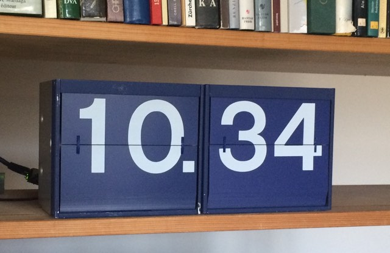
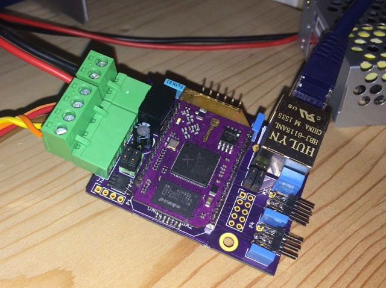
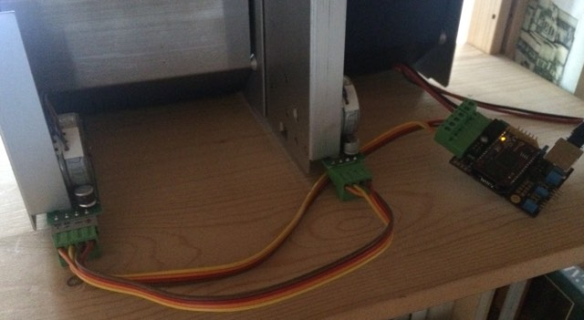

# p44sbbd - Controlling SBB "Fallblattanzeiger" modules

**work in progress!**

For running on OpenWrt/LEDE targets such as Onion Omega1/Omega2, you may want to use the p44sbbd package from the [plan44 feed](https://github.com/plan44/plan44-openwrt-feed.git).

This is the living room clock which is driven by the current version of p44sbbd, using a [onion.io](https://onion.io) Omega1 on a custom pcb.

Note that this is still work in progress - I have projects beyond just a clock using these modules ;-)

That's the controller; the [PCB is available at oshpark.com](https://oshpark.com/projects/0I4u4dcV)

And here's how it's wired:

(a simple meanwell 24V power supply with ability to adjust output to >=27V powers the thing, not visible on the picture)

